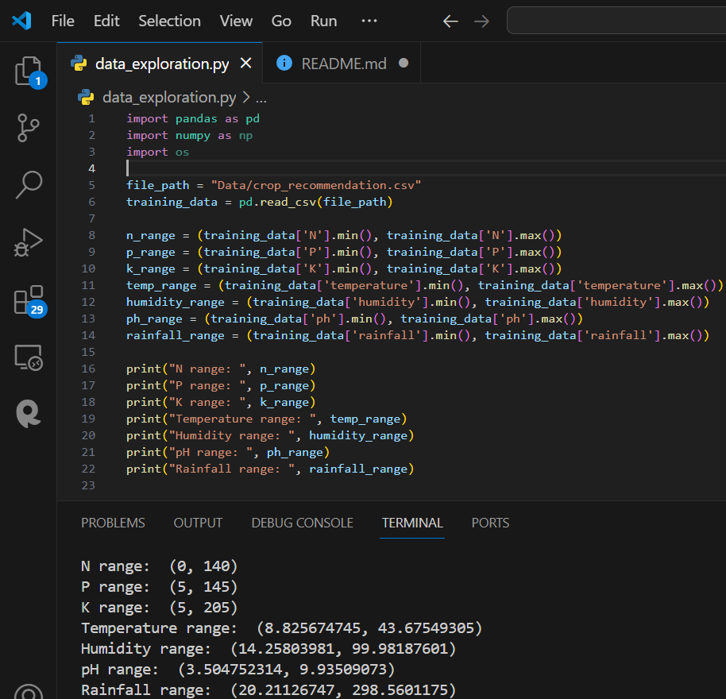
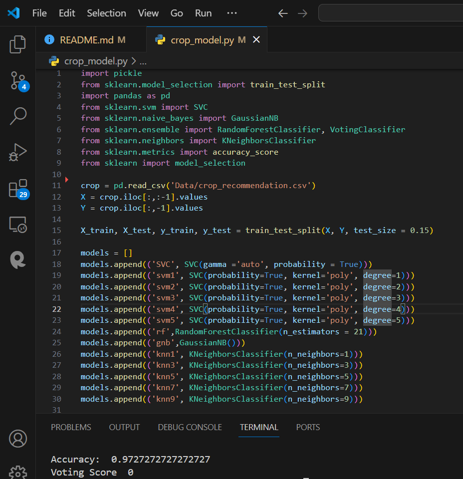
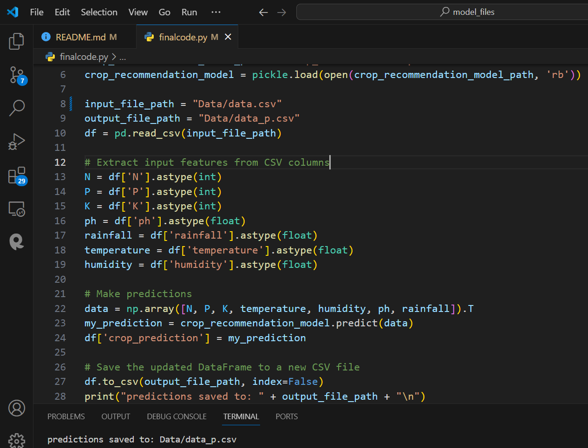
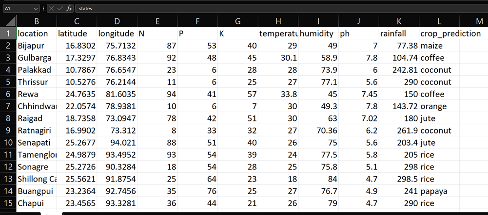

# Precision-agriculture-using-machine-learning-

## Problem Statement

Indian agriculture encounters multifaceted challenges, including diverse climatic conditions, varying soil compositions, and the need for crop diversification. Farmers often face difficulties in selecting appropriate crops for their regions, leading to suboptimal yields and resource mismanagement. Bridging this gap between available data and informed decision-making remains a critical need.

## Significance

The "Precision Farming Analysis" project aims to address the critical issues surrounding modern agricultural practices, specifically focusing on precision farming in India. Precision farming involves leveraging technology and data to optimize agricultural processes, enhance productivity, and minimize environmental impact. With the challenges faced by the agriculture sector in India, adopting precision farming practices becomes crucial for sustainable and efficient food production.

## Objectives of the Project

The primary objectives of the Precision Farming Analysis project are as follows:

1. Evaluate Current Practices: To assess and analyze the existing agricultural practices in India and identify areas where precision farming can be implemented.
2. Understand Environmental Impact: To investigate the environmental impact of traditional farming methods and compare it with the potential benefits of precision farming.
3. Develop Precision Farming Strategies: To formulate practical and region-specific strategies for the adoption of precision farming technologies, including data-driven decision-making, IoT applications, and drone technology.
4. Raise Awareness: To raise awareness among farmers, policymakers, and the public about the advantages of precision farming, including increased yields, resource efficiency, and sustainability.

## Dataset Link-

1. https://www.kaggle.com/datasets/siddharthss/crop-recommendation-dataset?resource=download
2. https://weatherandclimate.com/

## Code exploration of the ML model

Exploration

Model accuracy

Prediction's by the model

## Conclusion

The project bridges the gap between data availability and informed decision-making in Indian agriculture, potentially revolutionizing farming practices for increased productivity and sustainability.
